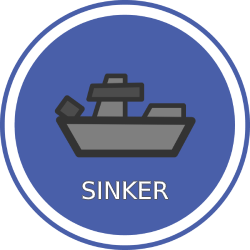
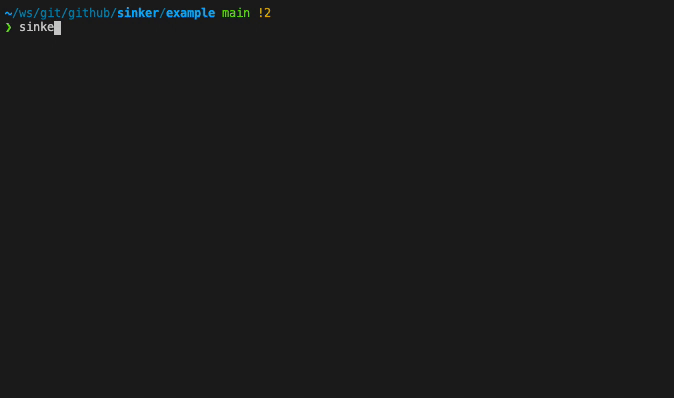

# Sinker

[](https://goreportcard.com/report/github.com/plexsystems/sinker)
[](https://github.com/plexsystems/sinker/releases)



`sinker` syncs container images from one registry to another. This is useful in cases when you rely on images that exist in a public container registry, but need to pull from a private registry.

Images can be sync'd either by using [The image manifest](#the-image-manifest) or via the command line.

See the [example](https://github.com/plexsystems/sinker/tree/main/example) folder for more details on the produced files.

## Installation

`go install github.com/plexsystems/sinker@latest`

Releases are also provided in the [releases](https://github.com/plexsystems/sinker/releases) tab on GitHub.

## The image manifest

### The target section

```yaml
target:
  host: mycompany.com
  repository: myteam
```

The `target` section is where the images will be synced to. The above yaml would sync all images to the `myteam` repository hosted at `mycompany.com` (`mycompany.com/myteam/...`)

### The images section

```yaml
target:
  host: mycompany.com
  repository: myteam
sources:
- repository: coreos/prometheus-operator
  host: quay.io
  tag: v0.40.0
- repository: super/secret
  tag: v0.3.0
  auth:
    username: DOCKER_USER_ENV
    password: DOCKER_PASSWORD_ENV
- repository: nginx
  digest: sha256:bbda10abb0b7dc57cfaab5d70ae55bd5aedfa3271686bace9818bba84cd22c29
```

### Optional host defaults to Docker Hub

In both the `target` and `sources` section, the `host` field is _optional_. When no host is set, the host is assumed to be Docker Hub.

### Auth

All auth is handled by looking at the clients Docker auth. If the client can perform a `docker push` or `docker pull`, sinker will be able to as well.

Optionally, the `auth` section allows you to set the names of _environment variables_ that will be used for creating basic auth to the registry. This could be useful in pipelines where auth is stored in environment variables.

## Sync behavior

If the `target` registry supports nested paths, the entire source repository will be pushed to the target. For example, the `prometheus-operator` would be pushed to:

```text
mycompany.com/myteam/coreos/prometheus-operator:v0.40.0
```

**Registries that support nested paths:** Azure Container Registry (ACR), Amazon Elastic Container Registry (ECR), Google Container Registry (GCR)

If the `target` registry does _not_ support nested paths, only the base path of the source will be pushed to the target registry. For example, the `prometheus-operator` would be pushed to:

```text
mycompany.com/myteam/prometheus-operator:v0.40.0
```

**Registries that do not support nested paths:** Docker Hub, GitHub Container Registry, Quay.io

## Demo

An example run of the `sinker pull` command which pulls all images specified in the image manifest.



For additional help, you can run `sinker help`.
